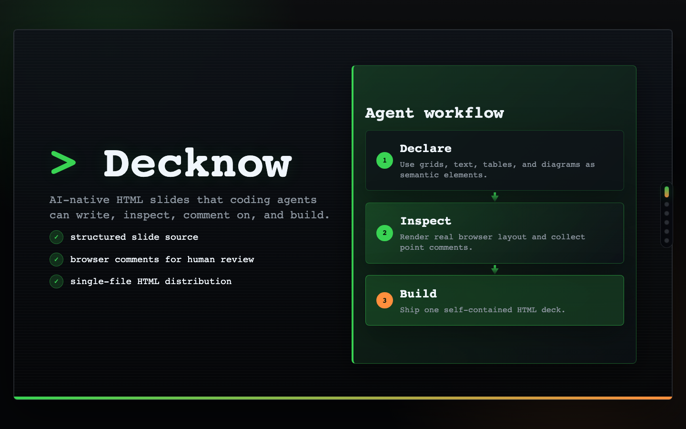

# Decknow



Decknow is an AI-native slide deck runtime.

It turns presentations into semantic HTML that coding agents can write, diff,
validate, inspect, comment on, and build into a single shareable file.

## Why Decknow

Slide decks are usually visual artifacts. That makes them painful for AI agents
to edit reliably.

Decknow treats a deck as source code:

- semantic `dk-*` elements instead of pixel-positioned shapes
- browser preview with point-and-comment feedback for human review
- layout inspection commands for agent-side verification
- built-in responsive runtime for desktop and portrait viewports
- single-file HTML builds for easy sharing
- repo-local plugin packages for themes and components

## Copy This

Install the agent skills into your project:

```bash
pnpm exec decknow skills install
```

Then give this to your AI coding agent:

```txt
Read `./skills/decknow/SKILL.md` and follow it. Use Decknow to create or edit my slide deck as semantic `dk-*` HTML, validate and inspect it with `pnpm exec decknow`, process browser comments when present, and build a single self-contained HTML file when ready.
```
